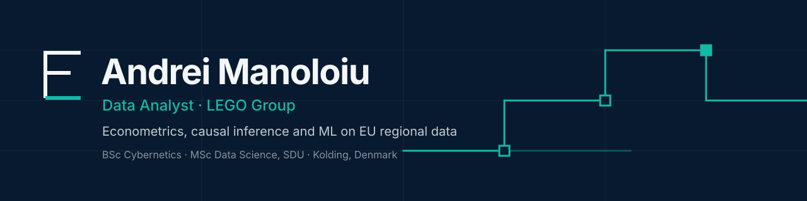

  

  
  
  
  
  
  

 

I build analysis that goes from raw data to a decision. My projects run end to end: ingestion, modelling, validation, and an interactive front end to explore the results. Most of them work on EU regional and macro data, using causal and panel methods.

## Featured projects

<table>
  <tr>
    <td width="50%" valign="top">
      <h3><a href="https://github.com/andrm101/rd-productivity-eu">rd-productivity-eu</a></h3>
      
Panel econometrics of R&amp;D and productivity across <b>29 European countries, 1998–2024</b>. Covers GMM/IV, spatial spillovers, local projections and causal forests. Extends my bachelor's thesis.

      
  

    </td>
    <td width="50%" valign="top">
      <h3><a href="https://github.com/andrm101/pl-capital-reform-did">pl-capital-reform-did</a></h3>
      
Causal analysis of Poland's 1999 reform that demoted <b>31 cities</b> from province capitals. Six estimators agree on direction: synthetic DiD puts the loss at <b>~4.5% of population</b>.

      
  

    </td>
  </tr>
  <tr>
    <td width="50%" valign="top">
      <h3><a href="https://github.com/andrm101/eu-gnn-risk-monitor">eu-gnn-risk-monitor</a></h3>
      
Graph neural network autoencoder that scores economic and political anomalies across EU NUTS2 regions. Unsupervised, and it <b>recovers the 2020 COVID shock</b> without being told the date.

      
  

    </td>
    <td width="50%" valign="top">
      <h3><a href="https://github.com/andrm101/pip-reform">pip-reform</a></h3>
      
Interactive four-layer map dashboard of EU NUTS2 regions: reform impact, innovation archetypes, investment suitability and GDP per capita.

      
  

    </td>
  </tr>
  <tr>
    <td width="50%" valign="top">
      <h3><a href="https://github.com/andrm101/thesis-interface-build">thesis-interface-build</a></h3>
      
Desktop app that reproduces my bachelor's thesis: augmented Solow model, K-Means typology, FE/RE with Hausman, unit-root tests and causal designs. Ships with CI and a Windows build.

      
  

    </td>
    <td width="50%" valign="top">
      <h3><a href="https://github.com/andrm101/project-for-data-modelling">project-for-data-modelling</a></h3>
      
KMeans, GMM and hierarchical clustering compared on silhouette, ARI and run-to-run stability. Finding: <b>initialization mattered more than algorithm choice</b>.

      
 

    </td>
  </tr>
</table>

**More:** [ro-administrative-reform](https://github.com/andrm101/ro-administrative-reform) · [eu-innovation-panel](https://github.com/andrm101/eu-innovation-panel) · [eu-megacampus-siting](https://github.com/andrm101/eu-megacampus-siting) · [ro-voting-prediction](https://github.com/andrm101/ro-voting-prediction) · [dsk805-companion](https://github.com/andrm101/dsk805-companion)

## Toolkit

| | |
|---|---|
| **Econometrics and causal inference** | Panel FE/RE, GMM/IV, difference-in-differences, synthetic control, local projections, panel VAR |
| **Machine learning** | scikit-learn, PyTorch, graph neural networks, clustering, causal forests |
| **Data and visualization** | pandas, DuckDB, matplotlib, Streamlit, Next.js, React |
| **Engineering** | Git, GitHub Actions, reproducible pipelines |

  

